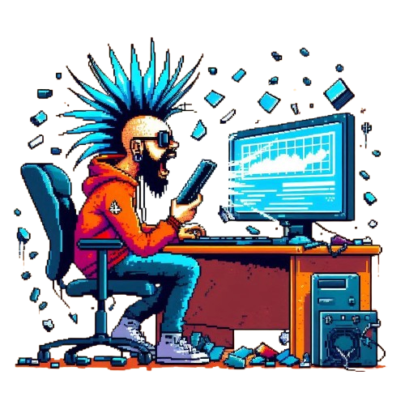

<h1 align="center" style="color: #ffffff;">Hi 👋, I'm Mattia Audisio</h1>
<h5 align="center" style="color: #ffffff;">Digital Craftsman (Web developer, Video editor)</h5>

  

- 🔭 I’m currently working on **Wordpress, Hugo, PHP, Boostrap**

- 🌱 I’m currently learning **Wordpress** and **Hugo**

- 💬 Ask me about **Music**, **Film**. **Photography**

<h3 align="left">Connect with me:</h3>

  
  
 
 

<h2 align="left">🧰 Languages and Tools:</h3>

### 👩‍💻 Languages

 
 
 
 
 
 

### 🚀 Frameworks & Library

 
 
 
  
 
 
 

### 🔌 IDE

 
 
 
 

### 💻 OS

 
 

#
 
### 📈 Le mie statistiche

&nbsp;

</p
